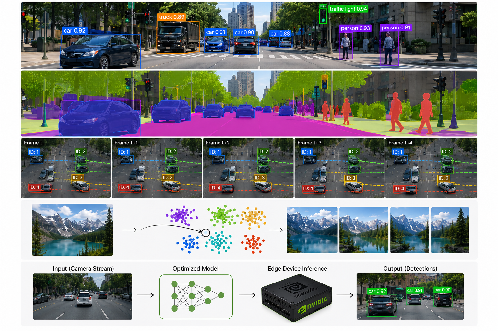

# 💫 About Me:
Hi, I'm Suraj Rao. I'm an AI Engineer specializing in computer vision currently pursuing my Master's in Applied Machine Learning at the University of Maryland.

Most of my journey in AI has been driven by a simple question: how do you take a model from an idea or research paper and make it useful in the real world?

Over the last few years, I've worked on problems across computer vision, multimodal AI, Edge AI, model optimization and machine learning systems. I've built and optimized solutions for video analytics, semantic search, object detection, and edge deployment in both industry and research settings. My work has taken me from deploying vision systems across multiple camera streams and accelerating inference on edge devices to building semantic search engines and evaluating state-of-the-art transformer architectures for challenging real-world use cases.

Along the way, I've realized that building useful AI isn't just about better models. It's about understanding the problem deeply, making the right trade-offs, and designing systems that are reliable in production. I enjoy the process of taking ideas from experimentation to deployment and continuously improving them through iteration and optimization.

Having studied and worked across several cities in India and now in the United States, I've come to appreciate different perspectives and ways of thinking. I try to contribute through both technical problem-solving and thoughtful collaboration, whether that's optimizing a system, exploring a new idea, or helping a project move forward.

Always happy to connect with people working on interesting problems in AI, research and engineering. You can reach out to me at surajrao@umd.edu

---

### 👁️ Building AI Systems from Perception to Deployment

---

## 🌐 Socials:
 
 

---

## 💻 Tech Stack:
 
 
 
 
 
 
 
 
 
 
 

---

## 📊 GitHub Stats:
 
 

---

